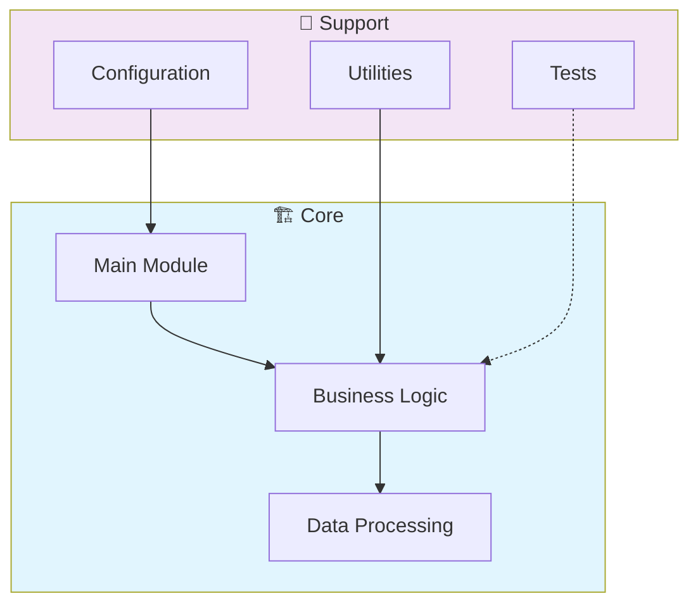

# 📊 Graph Analytics Platform

> High-performance graph analytics and network science platform using Julia for algorithms and Python for visualization, featuring community detection, centrality analysis, PageRank, and Neo4j integration

[](https://img.shields.io/badge/)
[](https://img.shields.io/badge/)
[](https://img.shields.io/badge/)
[](https://img.shields.io/badge/)
[](LICENSE)

[English](#english) | [Português](#português)

---

## English

### 🎯 Overview

**Graph Analytics Platform** is a production-grade Julia application complemented by Python that showcases modern software engineering practices including clean architecture, comprehensive testing, containerized deployment, and CI/CD readiness.

The codebase comprises **4,786 lines** of source code organized across **20 modules**, following industry best practices for maintainability, scalability, and code quality.

### ✨ Key Features

- **📊 Interactive Visualizations**: Dynamic charts with real-time data updates
- **🎨 Responsive Design**: Adaptive layout for desktop and mobile devices
- **📈 Data Aggregation**: Multi-dimensional data analysis and filtering
- **📥 Export Capabilities**: PDF, CSV, and image export for reports

### 🏗️ Architecture



### 🚀 Quick Start

#### Prerequisites

- Julia 1.10+

#### Installation

```bash
git clone https://github.com/galafis/graph-analytics-platform.git
cd graph-analytics-platform
```

```julia
using Pkg
Pkg.activate(".")
Pkg.instantiate()
```

### 🧪 Testing

Run the test suite to verify everything works correctly.

### 📁 Project Structure

```
graph-analytics-platform/
├── data/
│   ├── sample_networks/
│   │   └── README.md
│   └── generate_sample_data.py
├── examples/
│   ├── biological_network.py
│   ├── citation_network.jl
│   ├── social_network_analysis.py
│   └── transportation_network.jl
├── julia/
│   ├── centrality.jl
│   ├── community.jl
│   ├── link_prediction.jl
│   ├── pagerank.jl
│   ├── shortest_paths.jl
│   └── utils.jl
├── python/
│   ├── data_loader.py
│   ├── graph_analyzer.py
│   ├── julia_bridge.py
│   ├── metrics.py
│   └── visualization.py
├── tests/         # Test suite
│   ├── test_centrality.jl
│   ├── test_community.jl
│   ├── test_pagerank.jl
│   └── test_python_integration.py
├── CHANGELOG.md
├── CONTRIBUTING.md
├── INSTALLATION.md
├── LICENSE
├── Project.toml
├── README.md
└── requirements.txt
```

### 📊 Performance Metrics

The engine calculates comprehensive performance metrics:

| Metric | Description | Formula |
|--------|-------------|---------|
| **Sharpe Ratio** | Risk-adjusted return | (Rp - Rf) / σp |
| **Sortino Ratio** | Downside risk-adjusted return | (Rp - Rf) / σd |
| **Max Drawdown** | Maximum peak-to-trough decline | max(1 - Pt/Pmax) |
| **Win Rate** | Percentage of profitable trades | Wins / Total |
| **Profit Factor** | Gross profit / Gross loss | ΣProfit / ΣLoss |
| **Calmar Ratio** | Return / Max Drawdown | CAGR / MDD |
| **VaR (95%)** | Value at Risk | 5th percentile of returns |
| **Expected Shortfall** | Conditional VaR | E[R | R < VaR] |

### 🛠️ Tech Stack

| Technology | Description | Role |
|------------|-------------|------|
| **Julia** | Core Language | Primary |
| **NumPy** | Numerical computing | Framework |
| **Pandas** | Data manipulation library | Framework |
| **Plotly** | Interactive visualization | Framework |
| Python | 9 files | Supporting |

### 🤝 Contributing

Contributions are welcome! Please feel free to submit a Pull Request. For major changes, please open an issue first to discuss what you would like to change.

1. Fork the project
2. Create your feature branch (`git checkout -b feature/AmazingFeature`)
3. Commit your changes (`git commit -m 'Add some AmazingFeature'`)
4. Push to the branch (`git push origin feature/AmazingFeature`)
5. Open a Pull Request

### 📄 License

This project is licensed under the MIT License - see the [LICENSE](LICENSE) file for details.

### 👤 Author

**Gabriel Demetrios Lafis**
- GitHub: [@galafis](https://github.com/galafis)
- LinkedIn: [Gabriel Demetrios Lafis](https://linkedin.com/in/gabriel-demetrios-lafis)

---

## Português

### 🎯 Visão Geral

**Graph Analytics Platform** é uma aplicação Julia de nível profissional, complementada por Python que demonstra práticas modernas de engenharia de software, incluindo arquitetura limpa, testes abrangentes, implantação containerizada e prontidão para CI/CD.

A base de código compreende **4,786 linhas** de código-fonte organizadas em **20 módulos**, seguindo as melhores práticas do setor para manutenibilidade, escalabilidade e qualidade de código.

### ✨ Funcionalidades Principais

- **📊 Interactive Visualizations**: Dynamic charts with real-time data updates
- **🎨 Responsive Design**: Adaptive layout for desktop and mobile devices
- **📈 Data Aggregation**: Multi-dimensional data analysis and filtering
- **📥 Export Capabilities**: PDF, CSV, and image export for reports

### 🏗️ Arquitetura


### 🚀 Início Rápido

#### Prerequisites

- Julia 1.10+

#### Installation

```bash
git clone https://github.com/galafis/graph-analytics-platform.git
cd graph-analytics-platform
```

```julia
using Pkg
Pkg.activate(".")
Pkg.instantiate()
```

### 🧪 Testing

Run the test suite to verify everything works correctly.

### 📁 Estrutura do Projeto

```
graph-analytics-platform/
├── data/
│   ├── sample_networks/
│   │   └── README.md
│   └── generate_sample_data.py
├── examples/
│   ├── biological_network.py
│   ├── citation_network.jl
│   ├── social_network_analysis.py
│   └── transportation_network.jl
├── julia/
│   ├── centrality.jl
│   ├── community.jl
│   ├── link_prediction.jl
│   ├── pagerank.jl
│   ├── shortest_paths.jl
│   └── utils.jl
├── python/
│   ├── data_loader.py
│   ├── graph_analyzer.py
│   ├── julia_bridge.py
│   ├── metrics.py
│   └── visualization.py
├── tests/         # Test suite
│   ├── test_centrality.jl
│   ├── test_community.jl
│   ├── test_pagerank.jl
│   └── test_python_integration.py
├── CHANGELOG.md
├── CONTRIBUTING.md
├── INSTALLATION.md
├── LICENSE
├── Project.toml
├── README.md
└── requirements.txt
```

### 📊 Performance Metrics

The engine calculates comprehensive performance metrics:

| Metric | Description | Formula |
|--------|-------------|---------|
| **Sharpe Ratio** | Risk-adjusted return | (Rp - Rf) / σp |
| **Sortino Ratio** | Downside risk-adjusted return | (Rp - Rf) / σd |
| **Max Drawdown** | Maximum peak-to-trough decline | max(1 - Pt/Pmax) |
| **Win Rate** | Percentage of profitable trades | Wins / Total |
| **Profit Factor** | Gross profit / Gross loss | ΣProfit / ΣLoss |
| **Calmar Ratio** | Return / Max Drawdown | CAGR / MDD |
| **VaR (95%)** | Value at Risk | 5th percentile of returns |
| **Expected Shortfall** | Conditional VaR | E[R | R < VaR] |

### 🛠️ Stack Tecnológica

| Tecnologia | Descrição | Papel |
|------------|-----------|-------|
| **Julia** | Core Language | Primary |
| **NumPy** | Numerical computing | Framework |
| **Pandas** | Data manipulation library | Framework |
| **Plotly** | Interactive visualization | Framework |
| Python | 9 files | Supporting |

### 🤝 Contribuindo

Contribuições são bem-vindas! Sinta-se à vontade para enviar um Pull Request.

### 📄 Licença

Este projeto está licenciado sob a Licença MIT - veja o arquivo [LICENSE](LICENSE) para detalhes.

### 👤 Autor

**Gabriel Demetrios Lafis**
- GitHub: [@galafis](https://github.com/galafis)
- LinkedIn: [Gabriel Demetrios Lafis](https://linkedin.com/in/gabriel-demetrios-lafis)
